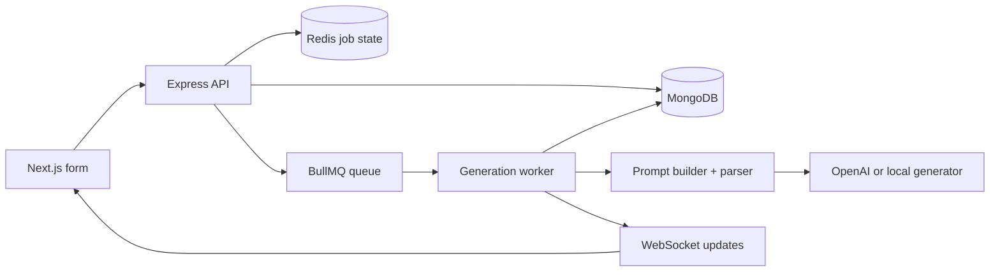

# VedaAI Assessment Creator

A polished AI Assessment Creator for the VedaAI internship assignment. Teachers can create assignments, generate structured question papers in the background, watch real-time job progress, review the output as a clean exam paper, regenerate it, and download a formatted PDF.

## Stack

- Frontend: Next.js, TypeScript, Zustand, WebSocket, lucide-react
- Backend: Node.js, Express, TypeScript, MongoDB, Redis, BullMQ, WebSocket
- AI: structured prompt builder with OpenAI support and a deterministic local generator fallback
- PDF: backend PDF generation with PDFKit

## Quick Start

```bash
npm install
cp .env.example .env
docker compose up -d
npm run dev
```

Open `http://localhost:3000`.

For public hosting, follow [DEPLOYMENT.md](DEPLOYMENT.md).

If MongoDB or Redis are not running, the app still boots in a graceful demo mode: assignments are kept in memory and generation jobs run immediately. For production-like behavior and for the assignment checklist, run `docker compose up -d`.

## Architecture

The frontend submits assignment requirements to the API. The API validates the request, stores an assignment document, caches job state in Redis when available, and enqueues a BullMQ generation job. The worker converts teacher inputs into a structured AI prompt, calls OpenAI when `OPENAI_API_KEY` exists, parses the model output into the strict question-paper schema, stores the result in MongoDB, and broadcasts job updates over WebSocket.



## Features Implemented

- Figma-inspired desktop and mobile UI
- Assignment list, empty state, search, delete, and details actions
- File upload field for PDF/text/images
- Due date, question type rows, question count, marks, subject, class, school, time limit, and additional instructions
- Validation for empty fields, past due dates, negative values, and missing question rows
- Zustand store for assignment state and live job updates
- WebSocket progress management with reconnect-safe client logic
- Structured prompt generation and strict schema parsing
- Sections A, B, etc., with instructions, difficulty badges, marks, and answer key
- MongoDB persistence for assignments and results
- Redis job state and BullMQ background processing
- PDF download endpoint using a real PDF renderer
- Regenerate action bar

## API

- `GET /health` service health
- `GET /assignments` list assignments
- `POST /assignments` create assignment and enqueue generation
- `GET /assignments/:id` get one assignment and result
- `DELETE /assignments/:id` delete assignment
- `POST /assignments/:id/regenerate` rerun generation
- `GET /assignments/:id/pdf` download generated PDF
- `WS /` real-time job updates

## Environment

```bash
MONGODB_URI=mongodb://localhost:27017/vedaai
REDIS_URL=redis://localhost:6379
OPENAI_API_KEY=
OPENAI_MODEL=gpt-4o-mini
API_PORT=4000
NEXT_PUBLIC_API_URL=http://localhost:4000
NEXT_PUBLIC_WS_URL=ws://localhost:4000
```

## Screenshots

### Desktop


### Mobile


## Notes

The backend never sends raw LLM text to the UI. AI output is parsed into a strict `QuestionPaper` object before storage and rendering. When no OpenAI key is configured, the local generator creates deterministic structured output so reviewers can test the full workflow immediately.
